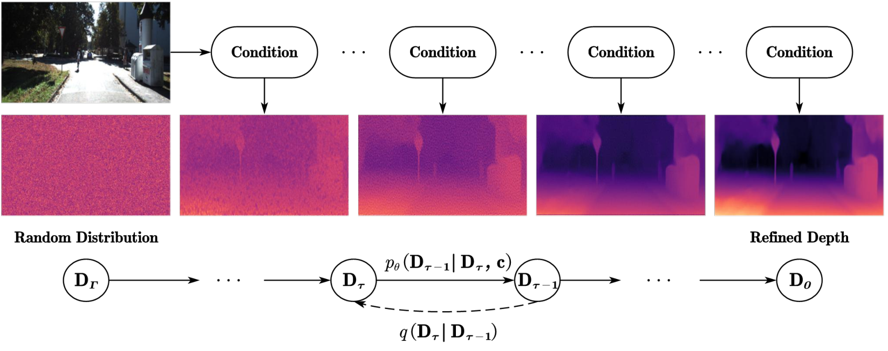

<h1>MonoDiffusion: Self-Supervised Monocular Depth Estimation Using Diffusion Model</h1>

    <a href='https://scholar.google.com.hk/citations?hl=zh-CN&user=ecZHSVQAAAAJ' target='_blank'>Shuwei Shao</a>1&emsp;
    <a target='_blank'>Zhongcai Pei</a>1&emsp;
    <a href='https://scholar.google.com.hk/citations?hl=zh-CN&user=5PoZrcYAAAAJ' target='_blank'>Weihai Chen</a>1&emsp;
    <a target='_blank'>Dingchi Sun</a>1&emsp;
    <a href='https://scholar.google.com.hk/citations?hl=zh-CN&user=7E0QgKUAAAAJ' target='_blank'>Peter C. Y. Chen</a>2&emsp;
    <a href='https://scholar.google.com.hk/citations?hl=zh-CN&user=LiUX7WQAAAAJ' target='_blank'>Zhengguo Li</a>3&emsp;

    1Beihang University, 2National University of Singapore, 3A*STAR

    <h4 align="center">
        • <a href="https://arxiv.org/abs/2309.14137" target='_blank'>Arxiv 2023</a> •
    </h4>

<strong>In this work, we introduce a novel self-supervised depth estimation framework, dubbed MonoDiffusion, by formulating it as an iterative denoising process. Because the depth ground-truth is unavailable in the training phase, we develop a pseudo ground-truth diffusion process to assist the diffusion in MonoDiffusion. The pseudo ground-truth diffusion gradually adds noise to the depth map generated by a pre-trained teacher model. Moreover, the teacher model allows applying a distillation loss to guide the denoised depth. Further, we develop a masked visual condition mechanism to enhance the denoising ability of model. Extensive experiments are conducted on the KITTI and Make3D datasets and the proposed MonoDiffusion outperforms prior state-of-the-art competitors. </strong>

---

The source code is comming soon.
