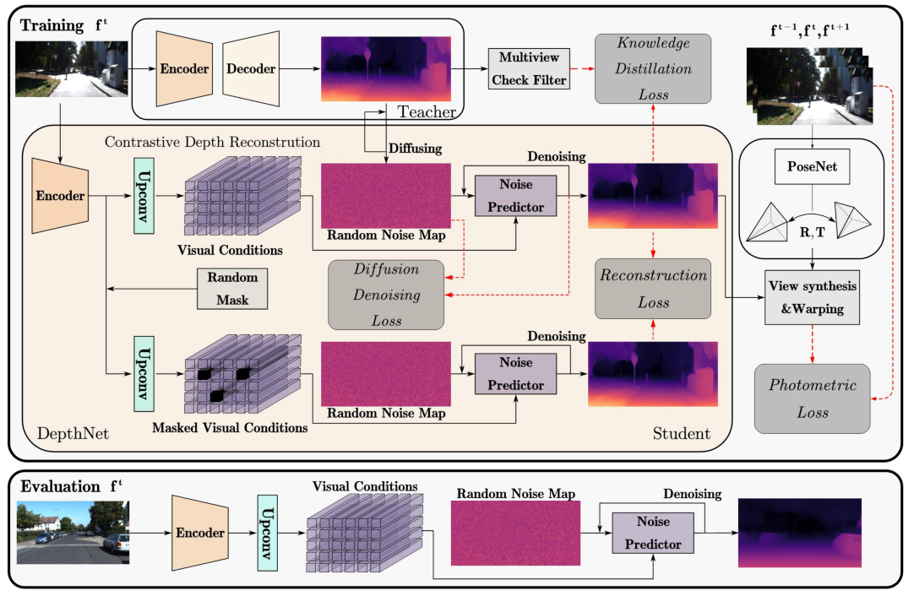

<div align="center">

<h1>MonoDiffusion: Self-Supervised Monocular Depth Estimation Using Diffusion Model</h1>

<div>
    <a href='https://scholar.google.com.hk/citations?hl=zh-CN&user=ecZHSVQAAAAJ' target='_blank'>Shuwei Shao</a><sup>1</sup>&emsp;
    <a target='_blank'>Zhongcai Pei</a><sup>1</sup>&emsp;
    <a href='https://scholar.google.com.hk/citations?hl=zh-CN&user=5PoZrcYAAAAJ' target='_blank'>Weihai Chen</a><sup>1</sup>&emsp;
    <a target='_blank'>Dingchi Sun</a><sup>1</sup>&emsp;
    <a href='https://scholar.google.com.hk/citations?hl=zh-CN&user=7E0QgKUAAAAJ' target='_blank'>Peter C. Y. Chen</a><sup>2</sup>&emsp;
    <a href='https://scholar.google.com.hk/citations?hl=zh-CN&user=LiUX7WQAAAAJ' target='_blank'>Zhengguo Li</a><sup>3</sup>&emsp;
</div>
<div>
    <sup>1</sup>Beihang University, <sup>2</sup>National University of Singapore, <sup>3</sup>A*STAR
</div>


<div>
    <h4 align="center">
        • <a href="https://ieeexplore.ieee.org/abstract/document/10772032" target='_blank'>TCSVT 2024</a> •
    </h4>
</div>

## Abstract

<div style="text-align:center">

</div>

</div>
<strong>Over the past few years, self-supervised monocular depth estimation has received widespread attention. Most efforts focus on designing different types of network architectures and loss functions or handling edge cases, for example, occlusion and dynamic objects. In this work, we take another path and propose a novel conditional diffusion-based generative framework for self-supervised monocular depth estimation, dubbed MonoDiffusion. Because the depth ground-truth is unavailable in a self-supervised setting, we develop a new pseudo ground-truth diffusion process to assist the diffusion for training. Instead of diffusing at a fixed high resolution, we perform diffusion in a coarse-to-fine manner that allows for faster inference time without sacrificing accuracy or even better accuracy. Furthermore, we develop a simple yet effective contrastive depth reconstruction mechanism to enhance the denoising ability of model. It is worth noting that the proposed MonoDiffusion has the property of naturally acquiring the depth uncertainty that is essential to be implemented in safety-critical cases. Extensive experiments on the KITTI, Make3D and DIML datasets indicate that our MonoDiffusion outperforms prior state-of-the-art self-supervised competitors.<strong> 


## 💾 Overview

<p align="center">
 
</p>


## ⚙️ Setup

The experimental environments and command setup are based on [Lite-Mono](https://github.com/noahzn/Lite-Mono).

## 📦 Model zoo

You can download the model weights from the following [link](https://drive.google.com/file/d/1pVslFg2cnAtMrv2YP2qKGNm9JppibIBi/view?usp=sharing).

## ✏️ 📄 Citation

If you find our work useful in your research please consider citing our paper:

```
@article{shao2024monodiffusion,
  title={MonoDiffusion: self-supervised monocular depth estimation using diffusion model},
  author={Shao, Shuwei and Pei, Zhongcai and Chen, Weihai and Sun, Dingchi and Chen, Peter CY and Li, Zhengguo},
  journal={IEEE Transactions on Circuits and Systems for Video Technology},
  year={2024},
  publisher={IEEE}
}
```

## Acknowledgement

Our code is based on the implementation of [Lite-Mono](https://github.com/noahzn/Lite-Mono). We thank the authors for their excellent work and repository.

